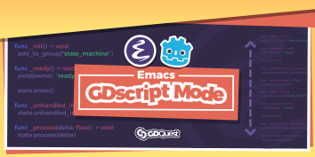

# GDScript mode for Emacs #



This package adds support for the GDScript programming language from the Godot game engine in Emacs. It gives syntax highlighting and indentations.

This is currently a work in progress, and my first time creating an Emacs package. Feedback, tips, and contributions are more than welcome!

## Features ##

This mode already features all the essentials:

- Syntax highlighting.
- Code folding.
- [Imenu](https://www.gnu.org/software/emacs/manual/html_node/emacs/Imenu.html).
- Support for scenes (`.tscn`) and script (`.gd`) files.
- Comment wrapping when using `fill-paragraph`.
- Indentation and auto-indentation: tab-based (default) and space-based.
- Automatic pairing of parentheses, brackets, etc.
- Code formatting using [gdformat](https://github.com/scony/godot-gdscript-toolkit/).
- Auto-completion for all the keywords in the `data/` directory.

## How to install ##

As it is in development, the package is not available yet on Emacs package managers.

To install it:

1. Clone the repository to your computer.
1. In your init.el file, add a call to load and require the package.

```lisp
(add-to-list 'load-path "/path/to/gdscript-mode.el")
(require 'gdscript-mode)
```

### Installing in Spacemacs ###

1. Clone the repository to the `private/local` subdirectory of your `.emacs.d` directory, where you installed spacemacs.
2. Add the package to the `dotspacemacs-additional-packages` and mark it as local. That's Spacemacs' feature to make it easy to load locally installed packages. 

```lisp
dotspacemacs-additional-packages '((gdscript-mode :location local))
```

3. In your `dotspacemacs/user-config` function, require the package.

```lisp
(defun dotspacemacs/user-config ()
  (require 'gdscript-mode))
```

### Installing in Doom Emacs ###

Add the following package definition to your `.doom.d/packages.el` file:

```lisp
(package! gdscript-mode
          :recipe (:host github
                   :repo "GDQuest/emacs-gdscript-mode"
                   :files ("*.el" "data/*.txt")))
```

Require the package in your `.doom.d/config.el` file:

```lisp
(require 'gdscript-mode)
```

## Formatting with gdformat ##

You can call the `gdscript-format` function to format the current buffer with `gdformat`. This feature requires the python package `gdtoolkit` to be installed and available on the system's PATH variable.

You can install gdtoolkit using the pip package manager from Python 3. Run this command in your shell to install it:

```
pip3 install gdtoolkit
```

## Customization ##

Set the following variables to customize gdscript-mode:

```lisp
(setq gdscript-tabs-mode t) ;; If true, use tabs for indents. Default: t
(setq gdscript-tab-width 4) ;; Controls the width of tab-based indents
```
